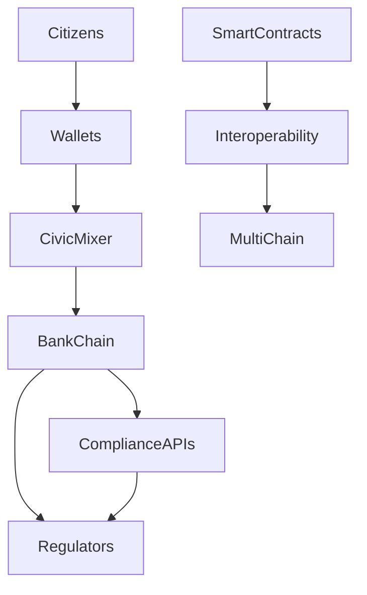

# 🧱 System Architecture

## Layers
- **Identity** → Digital ID, eWallet
- **Payments** → Civic mixer, Pi Taxi, BankChain
- **Governance** → Civic Ledger, Smart City
- **Interoperability** → Wormhole, Axelar, LayerZero
